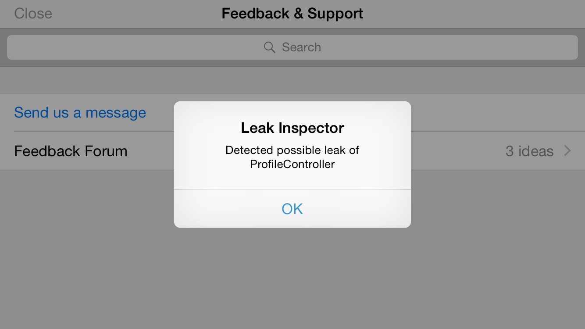

# LeakInspector

An iOS memory leak detection tool to help you prevent leaking UIViewControllers (and any other object you want to track to make sure it gets deallocated when expected). It only runs when running in the iOS simulator and short circuits on device so you don't need to worry about it running in your production app.

LeakInspector is written in Swift but works on Objective-C projects too. This project was inspired by [Square's Leak Canary](https://github.com/square/leakcanary) for Android. At [Two Bit Labs](http://twobitlabs.com) we use Leak Canary on our Android projects and have been so impressed with how it helped us catch memory leaks during the development cycle that we wanted a similar tool for the iOS apps we work on.

This was a quick proof of concept so there's a lot of room for improvement to make it more robust and helpful in identifying the source of a leak. 



## How to use it

At the moment we don't have Cocoapods or Carthage support so you'll need to git submodule it or just download a zip and drop the files directly into your project:

* [Download the latest zip file](https://github.com/twobitlabs/LeakInspector/archive/master.zip)

### Initialization

In your application delegate's didFinishLaunchingWithOptions, register the alert provider before any controllers are created: 

Objective-C:

```
[LeakInspector setDelegate:[LeakInspectorAlertProvider new]];
```

Swift:

```
LeakInspector.delegate = LeakInspectorAlertProvider()
```

That's it. When running on the simulator LeakInspector will now warn you if it thinks a controller might have leaked! 

The default *LeakInspectorAlertProvider* will show a UIAlertController whenever a possible leak is found. If you'd rather do something else when a leak is found just set the delegate to be your own app delegate or some other class that implements the *LeakInspectorDelegate* protocol. LeakInspector keeps a strong reference to its delegate so that you can set it and forget it (but something to keep in mind if you implement your own delegate).

Leak Inspector keeps a weak reference to any objects it tracks and checks for leaks every 5 seconds. If it finds a controller that has not deallocated but has a nil navigationController and nil parentController it will flag it as a possible leak. 

You may have legitimate cases in your app where you remove a controller but want to hang on to it, have those controllers implement the empty *LeakInspectorIgnore* protocol.

### Watching other kinds of objects for memory leaks

When you are done using an object and want to be sure it gets deallocated just register it with LeakInspector. For example if you have some object that you know does a lot with blocks, GCD, etc that you want to make sure always gets cleaned up just track it:

Objective-C:

```
[self.pollingManager stopPolling];
[LeakInspector watch:self.pollingManager]; // Start tracking it and Leak Inspector will warn you if it doesn't get deallocated 
self.pollingManager = nil;
```

Swift:

```
pollingManager.stopPolling()
LeakInspector.watch(pollingManager)
pollingManager = nil
```

If you're registering multiple objects of the same class, there's a second version of the watch method that lets you pass an identifying name so that if a leak is discovered it will help you disambiguate which object leaked:

```
LeakInspector.watch(pollingManagerA, name: "News Feed PollingManager")
LeakInspector.watch(pollingManagerB, name: "Message PollingManager")
```

## I found a leak, now what?

Check any blocks to make sure they use weak self references, make sure any delegate properties in your own code are weak, etc. Please help out by sending a pull request with better troubleshooting steps for this section!

## Contributing

We love pull requests with bug fixes, features, and documentation updates! 

Feel free to add your name and link under the contributors section as part of your pull request so that way if we merge it you get credit as well!

## Contributors
 - [Two Bit Labs](http://twobitlabs.com/)
 - [Todd Huss](https://github.com/thuss)
 - [Chris Pickslay](https://github.com/chrispix)

